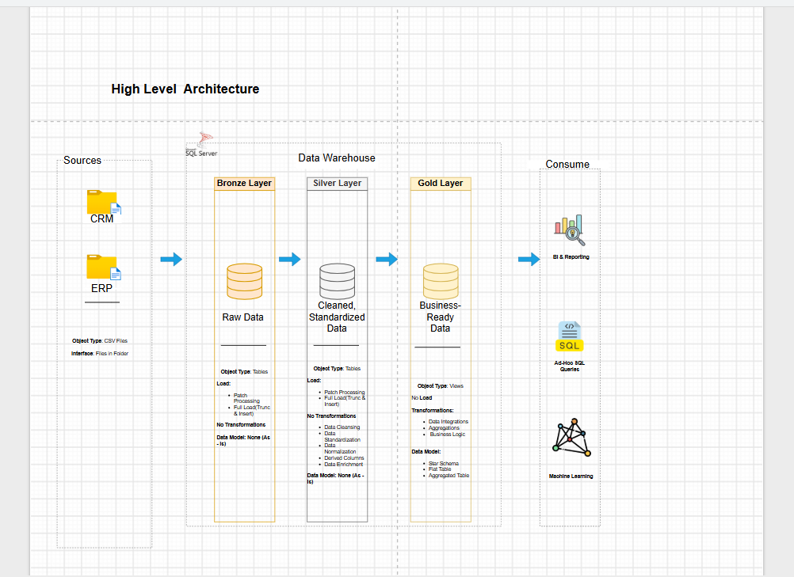
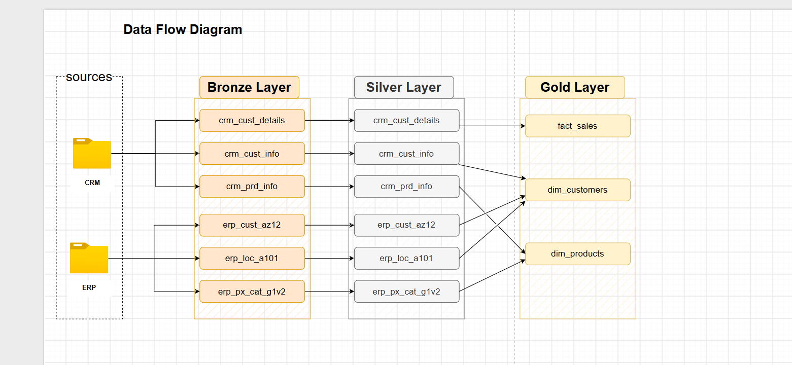
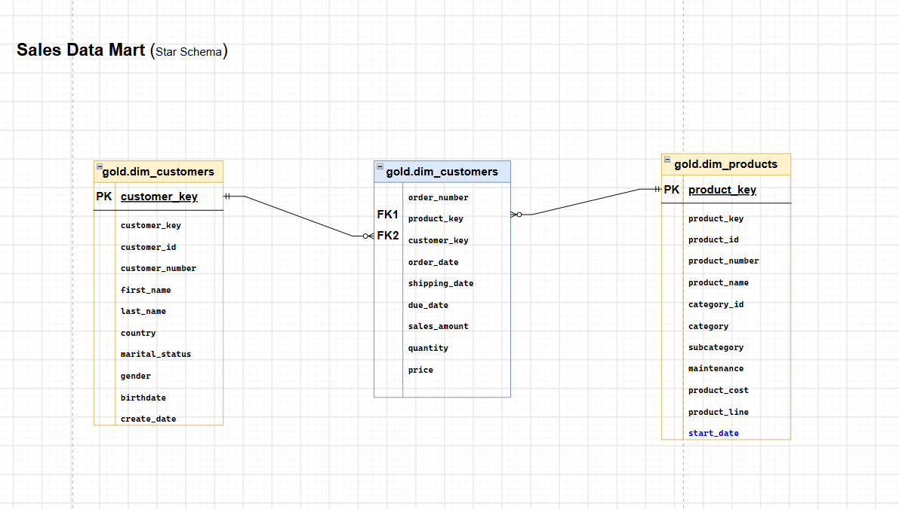
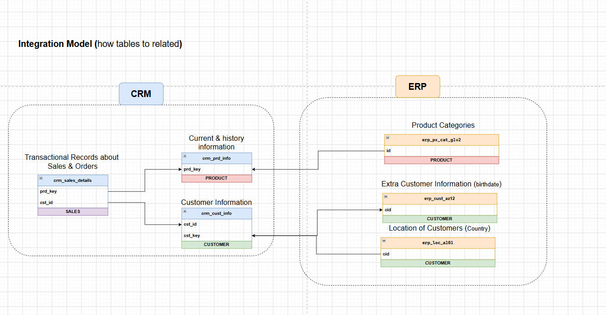

Absolutely. Based on your current repository structure and the SQL Data Warehouse project you've been building, I would make the README look professional but still suitable for a **Data Engineering portfolio/GitHub project**.

The LinkedIn icon below is clickable and redirects directly to your profile.

# 🏗️ SQL Data Warehouse & Analytics Project

A complete **SQL Server Data Warehouse project** built using a modern **Medallion Architecture (Bronze → Silver → Gold)**.

This project demonstrates the process of transforming raw data from **CRM and ERP source systems** into a clean, integrated, and analytics-ready data warehouse using **SQL Server**.

---

## 📌 Project Overview

The goal of this project is to build a scalable data warehouse that integrates data from multiple source systems, cleans and transforms the data, and provides a reliable foundation for analytics and reporting.

### 🔄 Data Flow

```text
CRM Sources ─────┐
                 │
                 ▼
            ┌─────────┐
            │  BRONZE │
            │  Layer  │
            └────┬────┘
                 │
                 ▼
            ┌─────────┐
            │ SILVER  │
            │  Layer  │
            └────┬────┘
                 │
                 ▼
            ┌─────────┐
            │  GOLD   │
            │  Layer  │
            └────┬────┘
                 │
                 ▼
           📊 Analytics
                 ▲
                 │
ERP Sources ─────┘
```

The architecture follows the **Medallion Architecture**:

* 🥉 **Bronze Layer** — Raw data loaded from source systems.
* 🥈 **Silver Layer** — Cleaned, standardized, and transformed data.
* 🥇 **Gold Layer** — Business-ready data designed for analytics and reporting.

---

## 🎯 Project Objectives

* Build a complete SQL Server Data Warehouse.
* Integrate data from **CRM** and **ERP** systems.
* Implement a **Bronze, Silver, and Gold** architecture.
* Load raw source data using `BULK INSERT`.
* Clean and standardize data.
* Handle duplicate and inconsistent records.
* Integrate CRM and ERP datasets.
* Create business-ready analytical tables.
* Implement data quality checks.
* Document the data architecture and data model.
* Follow a structured and maintainable SQL development workflow.

---

## 🛠️ Technologies Used

| Technology       | Purpose                                |
| ---------------- | -------------------------------------- |
| **SQL Server**   | Data warehouse database                |
| **T-SQL**        | Data transformation and ETL logic      |
| **BULK INSERT**  | Loading CSV source data                |
| **Draw.io**      | Architecture and data modeling         |
| **Git & GitHub** | Version control and project management |
| **CSV**          | Source data format                     |

---

# 🏛️ Architecture

The project uses a three-layer data warehouse architecture.

## 🥉 Bronze Layer

The Bronze layer stores data as close as possible to the original source.

### Responsibilities

* Load raw CRM data.
* Load raw ERP data.
* Preserve source information.
* Perform minimal transformations.
* Provide a reliable staging area for further processing.

### Source Systems

**CRM**

* Customer information
* Product information
* Sales transactions

**ERP**

* Customer information
* Location information
* Product category information

---

## 🥈 Silver Layer

The Silver layer contains cleaned and standardized data.

### Responsibilities

* Remove duplicates.
* Handle invalid values.
* Standardize formats.
* Clean customer information.
* Standardize product information.
* Transform dates.
* Handle missing values.
* Integrate CRM and ERP data.
* Apply business rules.

---

## 🥇 Gold Layer

The Gold layer contains business-ready data designed for analytics.

### Responsibilities

* Integrate business entities.
* Create analytical dimensions and facts.
* Provide a simplified structure for reporting.
* Present clean and meaningful business information.

---

# 📂 Repository Structure

```text
C:.
│   LICENSE
│   README.md
│
├───datasets
│   ├───source_crm
│   │       cust_info.csv
│   │       prd_info.csv
│   │       sales_details.csv
│   │
│   └───source_erp
│           CUST_AZ12.csv
│           LOC_A101.csv
│           PX_CAT_G1V2.csv
│
├───doc
│       Architecture.drawio
│       Architecture.png
│       data_catalog.md
│       Data_Flow_Diagram.drawio
│       Data_Flow_diagram.png
│       Data_Model.drawio
│       Data_Model.png
│       integration_model.png
│       tables_info.drawio
│
├───scripts
│   │   init_database.sql
│   │
│   ├───bronze
│   │       ddl_bronze_layer_script.sql
│   │       load_bronze_layer.sql
│   │
│   ├───gold
│   │       ddl_gold.sql
│   │
│   └───silver
│           ddl_silver_layer_script.sql
│           proc_load_silver_layer.sql
│
└───tests
        quality_checks_selver_layer.sql
        quality_check_gold_layer.sql
```

---

# 📊 Source Systems

## CRM

The CRM source contains information related to customers, products, and sales.

```text
source_crm/
├── cust_info.csv
├── prd_info.csv
└── sales_details.csv
```

### `cust_info.csv`

Contains customer-related information such as:

* Customer ID
* Customer key
* First name
* Last name
* Marital status
* Gender
* Creation date

### `prd_info.csv`

Contains product information such as:

* Product ID
* Product key
* Product name
* Product cost
* Product line
* Start date
* End date

### `sales_details.csv`

Contains sales transaction information such as:

* Order number
* Product key
* Customer ID
* Order date
* Shipping date
* Due date
* Sales amount
* Quantity
* Price

---

# 🏢 ERP

The ERP source contains additional customer, location, and product category information.

```text
source_erp/
├── CUST_AZ12.csv
├── LOC_A101.csv
└── PX_CAT_G1V2.csv
```

These datasets are integrated with the CRM data during the transformation process.

---

# ⚙️ ETL Process

The project follows an ETL-style workflow:

```text
Extract
   │
   ▼
Source CSV Files
   │
   ▼
Load
   │
   ▼
Bronze Layer
   │
   ▼
Transform
   │
   ▼
Silver Layer
   │
   ▼
Integrate & Model
   │
   ▼
Gold Layer
   │
   ▼
Analytics
```

---

# 🥉 Bronze Layer Scripts

Located in:

```text
scripts/bronze/
```

### `ddl_bronze_layer_script.sql`

Creates the Bronze layer tables.

### `load_bronze_layer.sql`

Loads the source CSV files into the Bronze layer.

The loading process uses SQL Server `BULK INSERT` and includes batch-level execution tracking and error handling.

> **Important:** Update the CSV file paths inside the loading procedure to match your local environment before executing it.

---

# 🥈 Silver Layer Scripts

Located in:

```text
scripts/silver/
```

### `ddl_silver_layer_script.sql`

Creates the Silver layer tables.

### `proc_load_silver_layer.sql`

Contains the transformation and loading logic for the Silver layer.

The transformation process includes:

* Data cleansing
* Standardization
* Duplicate handling
* Data validation
* CRM/ERP integration
* Business rule implementation

---

# 🥇 Gold Layer Scripts

Located in:

```text
scripts/gold/
```

### `ddl_gold.sql`

Creates the analytical Gold layer structures.

The Gold layer provides a business-oriented view of the warehouse and prepares the data for reporting and analytics.

---

# 🧪 Data Quality

Data quality checks are located inside:

```text
tests/
```

The tests validate the quality and consistency of the transformed data.

### Silver Layer Checks

```text
tests/quality_checks_selver_layer.sql
```

Examples of checks include:

* Duplicate records
* Null values
* Invalid keys
* Invalid dates
* Data consistency
* Referential integrity

### Gold Layer Checks

```text
tests/quality_check_gold_layer.sql
```

These checks verify that the final analytical layer contains valid and consistent business data.

---

# 📚 Documentation

The `doc` directory contains the project's documentation and visual models.

```text
doc/
├── Architecture.drawio
├── Architecture.png
├── data_catalog.md
├── Data_Flow_Diagram.drawio
├── Data_Flow_diagram.png
├── Data_Model.drawio
├── Data_Model.png
├── integration_model.png
└── tables_info.drawio
```

### Architecture



### Data Flow



### Data Model



### Integration Model



---

# 🚀 How to Run the Project

## 1. Clone the repository

```bash
git clone <YOUR_GITHUB_REPOSITORY_URL>
```

## 2. Open the project

Open the cloned project using your preferred IDE, such as:

* SQL Server Management Studio
* Visual Studio Code

## 3. Create the database

Execute:

```text
scripts/init_database.sql
```

This initializes the Data Warehouse database and required schemas.

## 4. Create the Bronze Layer

Execute:

```text
scripts/bronze/ddl_bronze_layer_script.sql
```

## 5. Configure the source paths

Update the `BULK INSERT` file paths inside:

```text
scripts/bronze/load_bronze_layer.sql
```

Replace the example path with the path to your local repository.

## 6. Load the Bronze Layer

Execute the Bronze loading procedure.

## 7. Create and load the Silver Layer

Execute:

```text
scripts/silver/ddl_silver_layer_script.sql
```

Then execute:

```text
scripts/silver/proc_load_silver_layer.sql
```

## 8. Create the Gold Layer

Execute:

```text
scripts/gold/ddl_gold.sql
```

## 9. Run Data Quality Checks

Execute the SQL scripts inside:

```text
tests/
```

---

# 🔍 Key SQL Concepts Demonstrated

This project demonstrates practical usage of:

* `CREATE DATABASE`
* `CREATE SCHEMA`
* `CREATE TABLE`
* `DROP TABLE`
* `TRUNCATE TABLE`
* `BULK INSERT`
* Stored Procedures
* `CREATE OR ALTER PROCEDURE`
* `TRY...CATCH`
* `GETDATE()`
* `ROW_NUMBER()`
* `PARTITION BY`
* `CASE`
* `COALESCE`
* `CAST`
* `CONVERT`
* `SUBSTRING`
* `CONCAT`
* `JOIN`
* `LEFT JOIN`
* CTEs
* Data validation
* Data cleansing
* Data integration
* Data quality testing

---

# 📈 Skills Demonstrated

Through this project, I practiced and demonstrated:

### Data Engineering

* ETL pipeline development
* Data ingestion
* Data transformation
* Data integration
* Data quality
* Data warehouse architecture

### SQL

* Advanced T-SQL
* Stored procedures
* Data cleansing
* Window functions
* Joins
* Error handling
* Database and schema management

### Data Architecture

* Medallion Architecture
* Bronze/Silver/Gold layers
* Source system integration
* Data modeling
* Analytical data design

### Development Practices

* Git
* GitHub
* Repository organization
* Documentation
* SQL script separation
* Testing

---

# 🎯 Project Learning Outcomes

This project helped me understand how raw data from different operational systems can be transformed into a structured analytical data warehouse.

The main concepts I practiced were:

```text
Raw Data
   ↓
Data Ingestion
   ↓
Data Cleaning
   ↓
Data Transformation
   ↓
Data Integration
   ↓
Data Modeling
   ↓
Data Quality
   ↓
Analytics-Ready Data
```

---

# 👨‍💻 Author

**Rayan Alsubhi**

Data Science Student | Aspiring Data Engineer

<a href="https://www.linkedin.com/in/rayan-alsubhi-351562301/">
  
</a>

---

# ⭐ If You Find This Project Useful

Feel free to explore the repository, review the SQL scripts, and use the project as a reference for learning SQL Server and Data Engineering concepts.

**Thank you for visiting! 🚀**
